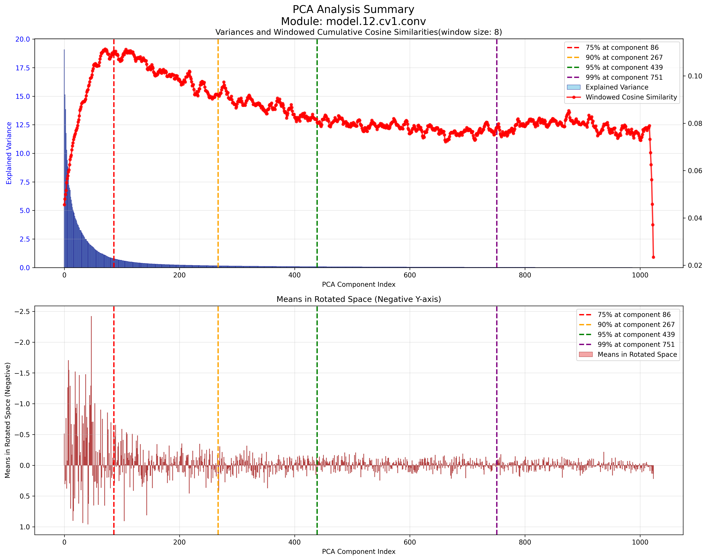
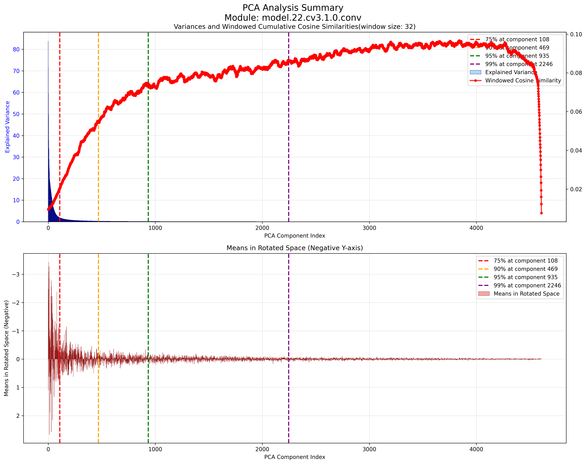
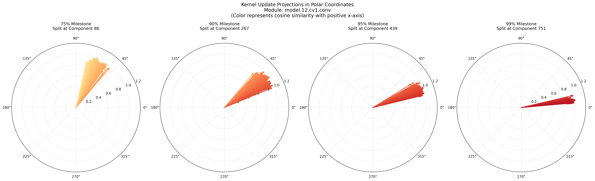
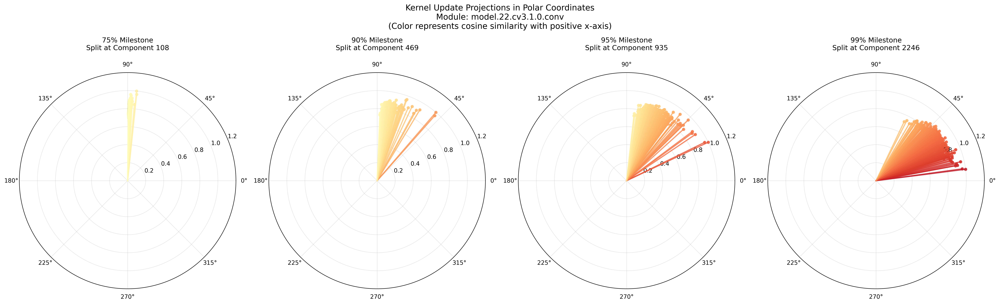

## baseline training
第一个实验，是在voc数据集上进行了yolo11m baseline的训练，用于和后续增量学习情景进行对照。实验结果保存至results_baseline.zip。

## 2025/08/09

跑了三组实验：naive, pseudo labels和dual teachers。naive就是用同一组权重，顺序地在每个任务集上进行训练，不采取任何增量学习的手段。
pseudo labels就是在学习每个任务集之前，用上一个任务学习得到的权重在新数据集上进行推理，将推理的结果保存成伪标签，添加到数据集标签当中，起到模型蒸馏的作用。
dual teachers是在新数据集上训练一个专家模型，然后分别用专家模型和上一个数据集训练得到的基础模型进行推理，生成伪标签，相当于同时蒸馏专家模型和基础模型。
在这一次的实验里，伪标签仅仅在训练集上生成，未在验证集上生成。这是为了避免旧任务的类别伪标签当中，检测错误的实例干扰模型评估，使得选取到次优的模型权重。但是从实验结果来看，验证集上不使用伪标签，会导致模型的遗忘较为明显。

实验结果保存至results_20250809.zip。

## 2025/08/11

跑了两组实验，yolov11m_inc_15_1_1_1_1_1_full-labels_fromscratch_naive和yolov11m_inc_15_1_1_1_1_1_full-labels_fromscratch_naive_2。

这两组实验使用的是VOC_inc_15_1_1_1_1_1_full-labels数据集，这个数据集是基于VOC_inc_15_1_1_1_1_1构建的，但是在每一个增量任务训练集当中，不仅包含当前任务类别实例的标注，还包括此前所学习的全部类别实例的标注。这样是为了实验出伪标签蒸馏方法理论上的最优效果：即教师模型能够以100%准确率识别出任务数据集当中含有的历史类别实例。

其中yolov11m_inc_15_1_1_1_1_1_full-labels_fromscratch_naive的验证集既包含旧任务类别的实例标签，又包含新任务类别的实例标签。而yolov11m_inc_15_1_1_1_1_1_full-labels_fromscratch_naive_2的验证集只包含新任务类别的实例标签。

实验结果显示，单独的伪标签蒸馏手段，无法实现对抗遗忘的效果。这是由于新任务数据集当中，新类别实例远远超过旧类别实例，造成类别监督信号不平衡。并且还观察到，任务数据集的规模较小，丰富程度较低的时候，会出现过拟合现象。

实验结果保存至results_20250811.zip。

# 2025/08/12

将基础模型替换为yolov8m，重新实验了伪标签、双教师、全标签对照组。结果与yolo11m区别不大。

# 2025/08/19

进行了一组实验，使用了数据集VOC_inc_15_1_1_1_1_1_full-labels_only-train，用来模拟伪标签策略的理论最优情况。训练过程中每3个epoch保存一次checkpoint，并绘制了在不同任务数据集上训练时，模型在各个任务的验证集上精度变化曲线，用来评估遗忘速度。我发现模型在旧任务的精度并不是预想当中持续的下降，而是在开头若干个epoch之内迅速下降到某个稳定的值，然后不再变化。相关结果保存至results_20250819.zip。

# 2025/09/09

跑了一组实验，按照VOC数据集上的15+5类增量进行实验。其中增量学习阶段，只更新检测头的权重。结果保存至results-20250909。测试结果如下。

||1-15|16-20|
|-|-|-|
|model-1|75.2|-|
|model-2|70.8|55.3|

从结果上来看，虽然有效缓解了遗忘现象，但是同时也极大地损害了增量学习阶段的学习效果。

# 2025/09/10

有两组实验结果。首先是增加了特征层蒸馏损失函数的实验结果，如下所示

||1-15|16-20|
|-|-|-|
|model-1|75.1|-|
|model-2|54|75.2|

重新实验了一遍只用伪标签进行蒸馏，并且所有层均可微调权重的实验结果，如下所示：

||1-15|16-20|
|-|-|-|
|model-1|75.1|-|
|model-2|52.2|74.7|

看起来似乎使用特征层蒸馏有些许提升，但是难以排除是不是随机波动的影响，而且提升效果没法达到实用程度。

# 2025/09/11

继续实验在第二阶段冻结部分权重的思路，首先是冻结整个backbone（1-9层），实验结果如下

||1-15|16-20|
|-|-|-|
|model-1|75.1|-|
|model-2|60.1|69.6|

对于遗忘的减轻十分显著，同时也没有过多地损害第二阶段本身的训练精度。

又在此基础上实现了OSR方法，结果如下

||1-15|16-20|
|-|-|-|
|model-1|75.1|-|
|model-2|57.1|69.8|

似乎使用了OSR方法以后遗忘反而加深了。这可能是由于OSR方法的样本回放，会增加数据集规模，所以在相同的训练轮数下，迭代次数增大了。而OSR所生成的回放样本与真实的历史样本分布有偏差，所以进行了更多次数的迭代以后，反而使得模型的分布偏移更大了。

最后是，实现了对于每一个卷积模块输入特征图的PCA，并且绘制了可视化。从可视化中可以观察到，特征图的通道确实存在冗余，真正有效的特征方向是比较稀疏的。而且从图像上观察会发现，经过对数变换的特征值，与通道序号之间似乎存在双曲正切或者正切的函数关系，这一关系值得进一步研究。

# 2025/09/12

试验了投影损失函数，得到结果如下

||1-15|16-20|
|-|-|-|
|model-1|75.1|-|
|model-2|69.6|66.2|

与之相对比的是，不使用投影损失函数，仅仅使用伪标签蒸馏的方法，得到的结果如下
||1-15|16-20|
|-|-|-|
|model-1|75.1|-|
|model-2|60.1|69.6|

从结果上来看，使用了投影损失函数的方法，的确对于缓解遗忘和增加新任务的精度有更好的平衡性。

# 2025/09/13

重新测试了投影损失函数，得到结果如下

||1-15|16-20|
|-|-|-|
|model-1|75.1|-|
|model-2|68.8|66.9|

依然说明了该方法的有效性。

另外，我取消了对backbone的冻结，得到结果如下

||1-15|16-20|
|-|-|-|
|model-1|75.1|-|
|model-2|67.5|69.6|

和冻结backbone得到的结果差异不大。

# 2025/09/17

今天计划要做消融实验。

1. 利用VSPReg约束后的更新权重，它和显著子空间的夹角有多大？
我们首先应该给显著子空间划定一个标准，假定按照分位数p来取值，方差从大到小前p个方向所张成的空间称之为显著子空间。p需要根据可视化以后的方差分布图进行主观选取。
划定了显著子空间标准以后，我们要计算权重更新值在子空间上的投影长度，然后根据投影长度和更新向量长度的比值关系，计算出余弦值和夹角大小。
在可视化层面上，我们要绘制出每一层的若干个卷积核，其更新值与显著子空间夹角大小和余弦值的分布图，绘制成谱线图、频数直方图和排序后的数值分布图。

2. VSPReg能否使模型随着训练的加深，特征分布趋于方向稠密
划定多个训练阶段，每一个阶段结束以后，都在前几个阶段的数据集上进行逐层PCA并保存结果，可视化每一次PCA的结果。理想状况下，随着训练阶段的增多，各个主成分方向的方差应该趋于平衡，方向的利用情况应该趋于稠密。也就是按照方差从大到小排序后的排序图里，方差下降的曲线应该放缓。

3. VSPReg会不会影响权重更新？
对比使用VSPReg和不使用情况下，模型训练后的权重更新长度。这样可以看出VSPReg是仅仅约束了权重更新的方向，还是会限制权重更新的长度。

# 2025/10/25

消融实验由于出差被中断了，近期将重新实验。
昨天修改了vspreg的实验，在投影权重更新值之前，先对权重更新值进行正则化，这样可以避免优化器盲目地减少权重更新值大小，而忽略对齐方向到小方差方向。
昨天晚上用修改后的vspreg+kd策略，试验了voc数据集上的15+5和15+1*5增量设置，结果如下

15+5：
||1-15|16-20|
|---|---|---|
|model-1|75.1||
|model-2|64.2|70.4|

||1-15|1-20|
|---|---|---|
|model-*|75.1|55.8|

15+1*5
||1-15|16|17|18|19|20|
|---|---|---|---|---|---|---|
|model-1|75.1|
|model-2|64.1|47.3|
|model-3|50.2|20.7|81.3|
|model-4|39.6|7.86|64.7|83.4|
|model-5|36.1|16.9|58.4|51.6|88.7|
|model-6|27.1|17.7|35.6|39.5|63.8|72.0|

||1-15|1-16|1-17|1-18|1-19|1-20|
|---|---|---|---|---|---|---|
|model-*|75.1|61.1|44.2|33.1|28.9|22.1|

基于这两次的结果，我绘制了消融实验的图像。具体来说，我做了如下两个消融实验：

## 1.绘制直方图

绘制了权重更新向量在嵌入子空间的投影曲线与方差分布的对照直方图。我将历史任务数据的特征分布进行PCA，并按照PCA的主成分在中间层的嵌入空间中划分出子空间。具体而言，将PCA主成分按照方差从高到低进行排序，对于每一个主成分，以一定的窗口大小，选择排序关系当中相邻的几个主成分，张成子空间。计算每一个卷积核在该子空间上的平均投影长度。又将平均投影长度绘制成一条折线，与方差直方图绘制在一起。下面是两个示例：分别都来自于yolov8l_voc_inc_15_5_fromscratch实验的第二阶段。

从这两张图中，我们注意到，无论是在浅层卷积还是在深层卷积，嵌入空间当中的特征分布都是比较稀疏的。具体体现在，PCA分析以后，占据方差累积值前75%的方向，仅仅占全部主成分方向的不足10%。

但是，较为奇怪的是，在浅层网络当中，权重更新值主要集中于排序前半部分的主成分方向。具体表现为更新值在子空间的投影峰值大约出现在方差累计值75%的位置上。而对于深层网络，权重更新值则集中于方差累计值90%以后的区域。按照原本的设计，由方差缩放的投影损失函数约束的模型更新，应该在全部卷积层都符合后一种规律。这一矛盾之处暗示实验仍然有改进空间。

另外还有一个值得注意的现象是，根据均值的直方图，我们发现在方差较大的方向上，均值的投影也相对较大，而方差小的方向上均值的投影也小。这种相伴的关系有助于我们简化模型。

## 2.绘制极坐标图

绘制了权重更新向量相对于由前x%的PCA主成分张成的子空间及其正交补的分解。用一个极坐标系表示分解的夹角，其中x轴正方向代表前x%的PCA主成分张成的子空间，y轴正方向代表其正交补。以下是两个示例，来自于yolov8l_voc_inc_15_5_fromscratch实验的第二阶段。

这两张图体现了直方图当中观察到的矛盾现象。对于浅层卷积网络，由前75%方差方向划分的子空间当中，权重更新向量与y轴夹角明显大于深层网络。这符合直方图当中权重投影峰值集中于前75%的观察是符合的。

# 2025/10/26

基于昨天的观察，我们今天要进行一项实验。我们打算强制压缩yolo模型的中间卷积模块，从而验证激活值在潜在空间当中的分布稀疏性。

首先，让我们假设一个卷积模块（不包括非线性激活函数以及正则化层）被表达为了矩阵乘法形式：

$$
\bm Y=\bm{WX}
$$

其中$\bm X\in\R^{d\times L}$是原始输入特征图按照卷积核的滑动窗口进行展开以后的矩阵形式，每一列代表一个滑动窗口当中特征数值的展开向量，$L$是总的滑动窗口数量。$W\in\R^{c\times d}$是卷积权重的展开形式，每一行代表一个展开的卷积核。输出的矩阵$\bm Y\in\R^{c\times L}$是展开形式下的输出特征图，每一列都是一个$c$通道的特征像素，可以被直接恢复成$\R^{c\times H\times W}$的形式。

假设我们对$\bm X$的列进行PCA，就会得到旋转矩阵$\bm P\in\R^{d\times d}$，使得$\bm{PX}$的协方差矩阵是对角矩阵

$$
\bm{P(X-\overline X)(X-\overline X)^TP^T}=\text{diag}(\lambda_1,\lambda_2,\dots,\lambda_d)
$$

我们假设$\lambda_1,\lambda_2,\dots,\lambda_d$是按照大小进行降序排序的，那么根据上一天的消融实验观察，应该会存在一个$r \ll d$，使得$\sum_{i=1}^r{\lambda_i}$占全部方差的75%（或者其他的分位数）以上。于是我们构造压缩矩阵：

$$
\bm R=[\bm I_{(r)}, \bm 0]
$$

将卷积模块的操作通过以下方式进行近似压缩（由于在前一天的实验中，我们发现了均值和方差的大小关系总是相伴的，所以可以直接忽略掉均值的影响）

$$
\begin{align*}
\bm Y=&\bm{WX}\\
=&\bm{WP^TPX}\\
\simeq&\bm{WP^TR^T\cdot RPX}
\end{align*}
$$

其中，$\bm{RP}\in\R^{r\times d}$可以用$r$个卷积核组成的卷积模块实现，卷积核的尺寸参数与$\bm W$保持一致，$\bm{WP^TR^T}\in\R^{c\times r}$可以用$1\times 1$的卷积模块实现。

压缩前的卷积模块参数量是$O(c\times d)$，计算量是$O(c\times d\times L)$

压缩后的卷积模块参数量是$O(c\times r + r\times d)$，计算量是$O(c\times r \times L+r\times d\times L)$。

如果说卷积模块的输入和输出激活值在潜在空间当中确实具有分布稀疏性，那么通过这种方式构造的压缩模型，应该仅需要少量微调就可以恢复到压缩前的精度。如果这是成立的，那么通过冻结这部分压缩后的参数，就构成了增量学习的第一步基础。

# 2025/10/28

26日的实验尚未完成，需要重新推导卷积核的分解公式：

## 分解方式1：以感受野尺寸作为潜在空间维度

将输入的特征（经过了padding）$\bm X\in\R^{C_{in}\times h\times w}$和卷积核的权重$\bm W\in\R^{C_{out}\times\frac{C_{in}}{G}\times k\times k}$分别按照分组数$G$进行分组，得到

$$
\begin{align*}
\bm X_g&\in\R^{\frac{C_{in}}{G}\times h\times w}\\
\bm W_g&\in\R^{\frac{C_{out}}{G}\times\frac{C_{in}}{G}\times k\times k}\\
g&\in\{1,2,\dots,G\}
\end{align*}
$$

将分组卷积核展开，得到

$$
\bm W_g\in\R^{\frac{C_{out}}{G}\times\frac{C_{in}}{G} k^2}
$$

对于每一个分组的输入特征，通过滑动窗口的方式，按照卷积操作时的感受野尺寸，将其展开为列向量矩阵

$$
\bm X_g\in\R^{\frac{C_{in}}{G}k^2\times L}
$$

其中$L$根据卷积操作时步长和卷积核尺寸决定，公式为（无需padding值，因为$\bm X$已经在处理之前padding了）
$$
L = \left\lfloor \frac{h - k}{s} + 1 \right\rfloor \times \left\lfloor \frac{w - k}{s} + 1 \right\rfloor
$$

无偏置的情况下
$$
\begin{align*}
\bm W*\bm X&=\begin{bmatrix}\bm W_1\bm X_1\\
\bm W_2\bm X_2\\
\vdots\\
\bm W_G\bm X_G\end{bmatrix}\\
&=\begin{bmatrix}\bm W_1\bm P_1^T\bm P_1\bm X_1\\
\bm W_2\bm P_2^T\bm P_2\bm X_2\\
\vdots\\
\bm W_G\bm P_G^T\bm P_G\bm X_G\end{bmatrix}\\
&=\begin{bmatrix}\bm W_1\bm P_1^T\bm R^T\cdot\bm R\bm P_1\bm X_1\\
\bm W_2\bm P_2^T\bm R^T\cdot\bm R\bm P_2\bm X_2\\
\vdots\\
\bm W_G\bm P_G^T\bm R^T\cdot\bm R\bm P_G\bm X_G\end{bmatrix}\\
&=\begin{bmatrix}\bm A_1\cdot\bm B_1\bm X_1\\
\bm A_2\cdot\bm B_2\bm X_2\\
\vdots\\
\bm A_G\cdot\bm B_G\bm X_G\end{bmatrix}
\end{align*}
$$
其中$\bm A_g=\bm W_g\bm P_g^T\bm R^T,\ \bm B_g = \bm R\bm P_g$，$\bm P_g$是通过PCA找到的对特定分组特征进行正交变换从而将坐标轴对齐主成分方向的矩阵，$\bm R=[\bm I_{(r)},\bm 0]$是方向选择矩阵，其中的$r$根据在每一个分组内，方差在主成分方向索引的$p$分位数最大值选取。

$\bm B_g\bm X_g$可以用与初始卷积相同尺度和分组的卷积模块实现，$\bm A_g$可以用$1\times 1$的通道线性映射卷积模块实现。如果有偏置，可以统一放在后一个分解模块中。

反过来说，已知分解以后的卷积核权重是$\bm B\in\R^{rG\times\frac{C_{in}}{G}\times k\times k}$，线性映射卷积权重是$\bm A\in\R^{C_{out}\times r\times 1\times 1}$，那么还原回原始卷积权重的方法是，首先对卷积核进行分组与展开：

$$
\begin{align*}
\bm B_g&\in\R^{r\times\frac{C_{in}}{G}k^2}\\
\bm A_g&\in\R^{\frac{C_{out}}{G}\times r}
\end{align*}
$$

然后作矩阵乘法

$$
\begin{align*}
\bm W_g &= \bm A_g \bm B_g\in\R^{\frac{C_{out}}{G}\times \frac{C_{in}}{G}k^2}
\end{align*}
$$

再还原为$\bm W_g\in\R^{\frac{C_{out}}{G}\times \frac{C_{in}}{G}\times k\times k}$，并且拼接为$\bm W\in\R^{C_{out}\times \frac{C_{in}}{G}\times k\times k}$

## 分解方式2：以输入通道数为潜在空间维度

与方式1相同，对于输入的特征和卷积核权重进行分组：

$$
\begin{align*}
\bm X_g&\in\R^{\frac{C_{in}}{G}\times h\times w}\\
\bm W_g&\in\R^{\frac{C_{out}}{G}\times\frac{C_{in}}{G}\times k\times k}\\
g&\in\{1,2,\dots,G\}
\end{align*}
$$

但是我们不再对$\bm X_g$进行滑动窗口式的展开，而是直接将卷积操作表示一系列矩阵乘法的求和：

$$
\begin{align*}
\bm W_g*\bm X_g&=\sum_{i,j=0}^{k-1}W_g[:,:,i,j]\bm X_g[:,i::s,j::s]
\end{align*}
$$

其中$s$是卷积步长。

于是，我们对矩阵乘法$\bm W_g*\bm X_g=\sum_{i,j=0}^{k-1}\bm W_g[:,:,i,j]\bm X_g[:,i::s,j::s]$进行分解，公式如下：

$$
\begin{align*}
\bm W_g*\bm X_g&=\sum_{i,j=0}^{k-1}\bm W_g[:,:,i,j]\bm X_g[:,i::s,j::s]
\\
&=\sum_{i,j=0}^{k-1}\bm W_g[:,:,i,j]\bm P_g^T\bm R^T\cdot\bm R\bm P_g\bm X_g[:,i::s,j::s]\\
&=\sum_{i,j=0}^{k-1}\bm A_g[:,:,i,j]\cdot \bm B_g\bm X_g[:,i::s,j::s]
\end{align*}
$$

其中$\bm A_g[:,:,i,j]=\bm W_g[:,:,i,j]\bm P_g^T\bm R^T,\ \bm B_g = \bm R\bm P_g$，$\bm P_g$是通过PCA找到的对特定分组特征进行正交变换从而将坐标轴对齐主成分方向的矩阵，$\bm R=[\bm I_{(r)},\bm 0]$是方向选择矩阵，其中的$r$根据在每一个分组内，方差在主成分方向索引的$p$分位数最大值选取。需要注意的是，在这里，PCA分析时，是以$\bm X$在通道方向上的像素柱作为特征向量，而不是以展开的感受野作为特征向量。

$\bm B_g\bm X_g[:,i::s,j::s]$可以用$1\times 1$的通道线性映射卷积模块实现。$\sum_{i,j=0}^{k-1}\bm A_g[:,:,i,j]\cdot(\cdots)$可以用与初始卷积相同尺度和分组的卷积模块实现。如果有偏置，可以统一放在后一个分解模块中。

反过来说，已知分解以后的$1\times 1$线性映射卷积权重是$\bm B\in\R^{rG\times\frac{C_{in}}{G}\times 1\times 1}$，卷积权重是$\bm A\in\R^{C_{out}\times r\times k\times k}$，那么还原回原始卷积权重的公式是：

$$
\begin{align*}
\bm W_g[:,:,i,j] &= \bm A_g[:,:,i,j] \bm B_g = \bm A_g[:,:,i,j] \bm R\bm P_g
\end{align*}
$$

其中$\bm A_g \in \R^{\frac{C_{out}}{G} \times r}$是$\bm A$的第$g$个分组对应的子矩阵。